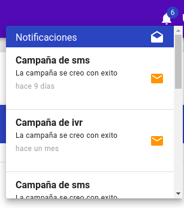
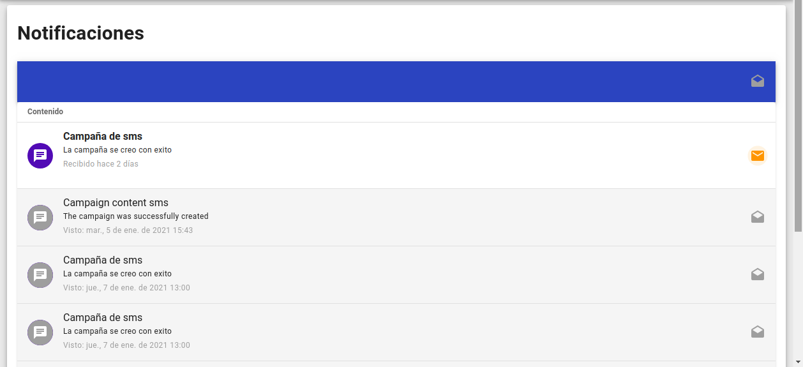

[![Contributors][contributors-shield]][contributors-url]
[![Stargazers][stars-shield]][stars-url]
# Dracul módulo de notificaciones

Este módulo contiene componentes que le permiten ver las notificaciones creadas con el backend del módulo de notificación.

## Este módulo contiene los siguientes componentes:

- Un botón con un icono de campanita donde se visualizará el número de notificaciones recibidas.
- Una sección donde se muestran todas las notificaciones de un determinado usuario, donde puede ver las notificaciones y marcarlas como leídas o no leídas.

## Instalación:

```
npm i @dracul/notification-frontend
```

## Ejemplo de uso:

_Un ejemplo de uso del componente **NotificationButton**._

```js
<template>
    <div>
        <notification-button :userId="123"/>
    </div>
</template>

<script>
    import {NotificationButton} from '@dracul/notification-frontend'

    export default {
    name:"SomeName",
    components: {NotificationButton}
}

</script>
```

## Componentes disponibles

### NotificationButton

**Definición y uso**

_Un botón con un icono de campana que muestra la cantidad de notificaciones recibidas.
Además, si presiona el botón, se desplegará una pequeña lista con notificaciones más detalladas._

**Vista del botón**


**Vista del botón con la lista desplegable**




**Como importar el componente en su proyecto:**
```js
import {NotificationButton} from '@dracul/notification-frontend'
```

**Props**

|Nombre  |Tipo |Descripción      | 
|----------|----------|----------------------------------------------------------------------------------------------|
|`userId`   |ObjectID  | Requerido. El ID de usuario a quien se mostrarán las notificaciones.                                                                    |
|`colorIcon`  |String   |Requerido. Se utilizará como color del icono de la campana.  Valor por defecto: 'onPrimary'.                                                                    |

---

## Páginas que expone el módulo.

_Este módulo se integra a Vue Router, el módulo exporta las rutas de cada página. 
Para usar estas rutas es necesario mergearlas con las rutas de su proyecto._

### notificationRoutes

**Definición y uso**

_Una página en la que se visualiza el listado de las notificaciones del usuario._

**Vista de la página**



**Como importar esta página en su proyecto:**

```js
import {notificationPage} from '@dracul/notification-frontend'
```
---

<!-- MARKDOWN LINKS & IMAGES -->
<!-- https://www.markdownguide.org/basic-syntax/#reference-style-links -->

[stars-shield]: https://img.shields.io/github/stars/draculjs/modular-framework.svg?style=flat-square
[stars-url]: https://github.com/draculjs/modular-framework/stargazers
[contributors-shield]: https://img.shields.io/github/contributors/draculjs/modular-framework.svg?style=flat-square
[contributors-url]: https://github.com/draculjs/modular-framework/graphs/contributors
